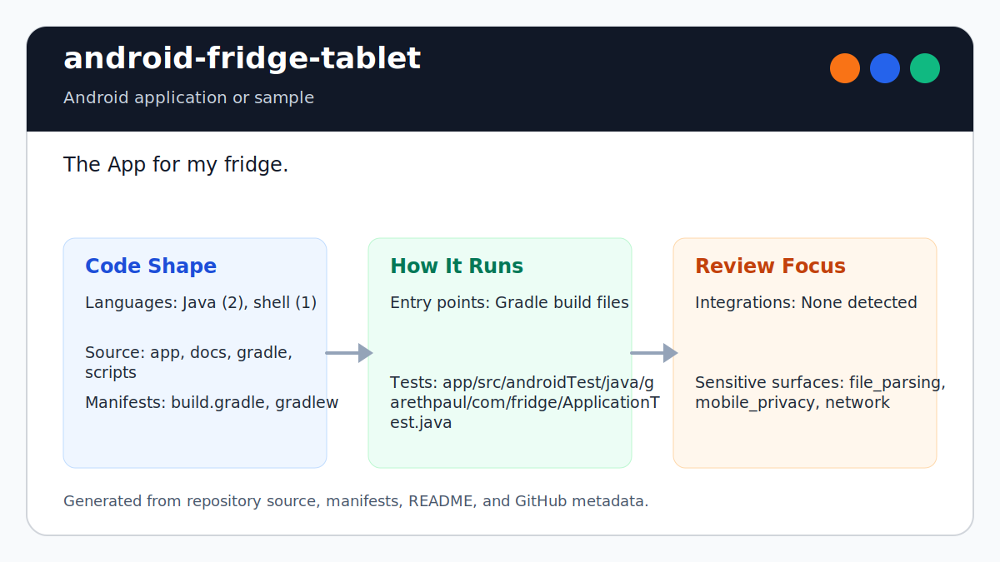
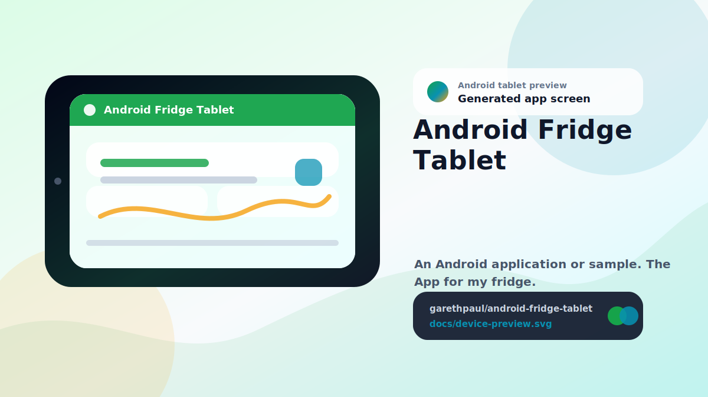

# android-fridge-tablet

<!-- README-OVERVIEW-IMAGE -->


## Device Preview

<!-- DEVICE-PREVIEW-IMAGE -->


## Overview

`garethpaul/android-fridge-tablet` is an Android application or sample. The App for my fridge.

This README is based on the checked-in source, manifests, scripts, and repository metadata on the `master` branch. The project language mix found during review was: Java (2), shell (1).

## Repository Contents

- `README.md` - project overview and local usage notes
- `build.gradle` - Android or Gradle build configuration
- `app` - source or example code
- `docs` - source or example code
- `gradle` - source or example code
- `gradlew` - Android or Gradle build configuration
- `scripts` - source or example code
- `SECURITY.md` - security reporting and disclosure guidance
- `VISION.md` - project direction and maintenance guardrails

Additional scan context:

- Source directories: app, docs, gradle, scripts
- Dependency and build manifests: build.gradle, gradlew
- Entry points or build surfaces: Gradle build files
- Test-looking files: app/src/androidTest/java/garethpaul/com/fridge/ApplicationTest.java

## Getting Started

### Prerequisites

- Git
- Android Studio or a compatible Android SDK
- Java 8 and the checked-in Gradle wrapper

### Setup

```bash
git clone https://github.com/garethpaul/android-fridge-tablet.git
cd android-fridge-tablet
make check
scripts/check-baseline.sh
./gradlew lint --no-daemon
./gradlew test --no-daemon
./gradlew assembleDebug --no-daemon
```

The setup commands above are derived from repository files. Legacy mobile, Python, or JavaScript samples may require older SDKs or package versions than a modern workstation uses by default.

The generated wrapper still executes Gradle 2.2.1 for compatibility. It uses
`distributionSha256Sum` to authenticate the downloaded distribution, while the
SDK-free baseline verifies the checked-in wrapper JAR and launchers. This does not make the first build offline-reproducible;
an uncached build still needs Gradle's HTTPS distribution service.

## Running or Using the Project

- Use Android Studio to open the project or run `./gradlew assembleDebug` when the Android SDK is configured.

## Testing and Verification

- `make check` - runs the source baseline and Android SDK-backed Gradle checks
  when `ANDROID_HOME` or `ANDROID_SDK_ROOT` is configured
- `scripts/check-baseline.sh` - runs SDK-free Fridge tablet baseline checks.
- The canonical GitHub Actions workflow installs Android API 22 and build-tools
  24.0.3, selects Java 8, and runs full `make check` on pushes, pull requests,
  and manual dispatches using Ubuntu 24.04 with superseded-run cancellation.
- Local Gradle checks accept `ANDROID_HOME` or `ANDROID_SDK_ROOT` and match the
  hosted toolchain contract.
- The baseline check protects internal storage, date formatting, layout
  resources, and fridge item input normalization.
- `./gradlew lint --no-daemon`, `./gradlew test --no-daemon`, and `./gradlew assembleDebug --no-daemon` when the Android SDK is configured.
- [`docs/plans/2026-06-12-gradle-wrapper-verification.md`](docs/plans/2026-06-12-gradle-wrapper-verification.md)
  records wrapper provenance and compatibility evidence.

The legacy plugin uses its non-queued PNG cruncher because AGP 1.1's newer
concurrent cruncher can fail nondeterministically on clean hosted builds. When
the SDK is unavailable locally, rely on the hosted matching toolchain.

Use [`DEVICE_VERIFICATION.md`](DEVICE_VERIFICATION.md) for the exact-commit
emulator/tablet storage matrix. It covers persistence, atomic replacement,
corruption, size limits, rollback, lifecycle, backup, privacy-safe evidence,
and explicit unexecuted rows.

## Configuration and Secrets

- No required secret or credential file was identified in the repository scan. If you add integrations later, keep secrets out of git.
- This legacy Android baseline pins Android build-tools 24.0.3 and preserves target SDK 21.
- Fridge items are stored in the app's internal files directory, so the app does not request external storage permissions.
- Fridge item input is trimmed before persistence, and whitespace-only entries
  are ignored.
- Line separators in fridge item input are converted to spaces so line-oriented
  storage reloads each submitted item as one list entry.
- A missing item input view is treated as empty input so stale tablet layouts
  do not crash item creation or keyboard setup.
- A missing list view skips list wiring, and stale long-click positions are
  ignored before item removal.
- A missing date header view skips the header update so stale tablet layouts do
  not crash startup.
- missing options menu callbacks return without inflating or handling menu
  items so stale action-bar paths do not crash the activity.
- Fridge item storage uses UTF-8 for local reads and writes instead of the
  device default charset.
- Fridge item writes use a same-directory temporary file and rename so a
  failed write does not truncate the existing list in place.
- Fridge item storage is capped at 1 MiB before parsing or durable replacement,
  preventing corrupted input or oversized output from becoming unbounded UI
  thread work.
- Fridge preflights the UTF-8 serialized size before opening temporary output
  and retains the post-write size check before durable replacement.
- Failed item writes roll back the visible list to its last durable state and
  show a localized warning without exposing item contents.
- An unreadable existing item file shows a localized warning and disables
  changes for that activity session so later writes cannot replace data that
  failed to load. A missing file remains a normal empty first-launch state.
- Keyboard restart and hide calls guard nullable input method services so
  tablet environments without a service do not crash the activity.
- Fridge item contents are not written to verbose logs during local storage
  reads or write failures.
- Read, write, and temporary-file cleanup failures use generic fridge storage
  failure logs without exception messages, stack traces, or internal paths.
- Storage permission failures use the same fail-closed read state and write
  rollback paths as I/O failures instead of escaping the activity.
- An unavailable app files directory fails reads closed and routes writes
  through the existing visible rollback path.
- Android backup is disabled in the checked-in manifest so local fridge-list
  contents stay out of platform backups by default.
- [`docs/plans/2026-06-13-fridge-storage-log-redaction.md`](docs/plans/2026-06-13-fridge-storage-log-redaction.md)
  records the storage logging contract and its verification evidence.

## Security and Privacy Notes

- Review changes touching network requests, sockets, or service endpoints; examples from the scan include app/src/androidTest/java/garethpaul/com/fridge/ApplicationTest.java, app/src/main/AndroidManifest.xml, app/src/main/res/layout/activity_main.xml, app/src/main/res/menu/menu_main.xml, and 4 more.
- Review changes touching mobile permissions or privacy-sensitive device data; examples from the scan include app/src/main/AndroidManifest.xml, gradlew.
- Review changes touching file, media, JSON, XML, CSV, OCR, or data parsing; examples from the scan include app/lint.xml, app/src/main/AndroidManifest.xml, app/src/main/java/garethpaul/com/fridge/MainActivity.java, app/src/main/res/values/color.xml, and 2 more.

## Maintenance Notes

- See `docs/plans/2026-06-14-fridge-device-verification-checklist.md` for the
  tablet/storage evidence matrix and runtime non-claims.

- This looks like a legacy Android project or sample. Expect Android SDK, Gradle, and support-library versions to matter.
- The current baseline keeps Gradle 2.2.1, Android Gradle Plugin 1.1.0, compile SDK 22, target SDK 21, and Android build-tools 24.0.3.
- The date header uses one-based formatting through `SimpleDateFormat`.
- See `SECURITY.md` for vulnerability reporting and safe research guidance.
- See `VISION.md` for project direction and contribution guardrails.
- See `docs/plans/2026-06-08-fridge-check-wrapper.md` for the root
  verification wrapper baseline.
- See `docs/plans/2026-06-09-fridge-item-input-normalization.md` for the item
  input normalization contract.
- See `docs/plans/2026-06-13-fridge-single-line-items.md` for the persisted
  single-line item boundary.
- See `docs/plans/2026-06-09-fridge-item-input-null-guard.md` for the item
  input null guard.
- See `docs/plans/2026-06-09-fridge-list-view-guards.md` for the list view
  null and stale-position guards.
- See `docs/plans/2026-06-09-fridge-date-header-guard.md` for the date header
  null guard.
- See `docs/plans/2026-06-09-fridge-menu-callback-guards.md` for menu callback
  null guards.
- See `docs/plans/2026-06-09-fridge-log-privacy.md` for the local item logging
  privacy contract.
- See `docs/plans/2026-06-09-fridge-backup-policy.md` for the local data backup
  policy contract.
- See `docs/plans/2026-06-09-fridge-keyboard-service-guard.md` for the input
  method service null-safety contract.
- See `docs/plans/2026-06-09-fridge-item-file-encoding.md` for the local item
  file encoding contract.
- See `docs/plans/2026-06-10-ci-baseline.md` for the GitHub Actions baseline.
- See `docs/plans/2026-06-12-hosted-android-verification.md` for the complete
  hosted Android lint, test, and build gate.
- See `docs/plans/2026-06-12-fridge-read-failure-write-guard.md` for the
  fail-closed item-read contract.

## Contributing

Keep changes small and tied to the project that is already present in this repository. For code changes, document the toolchain used, avoid committing generated dependency directories or local configuration, and update this README when setup or verification steps change.
